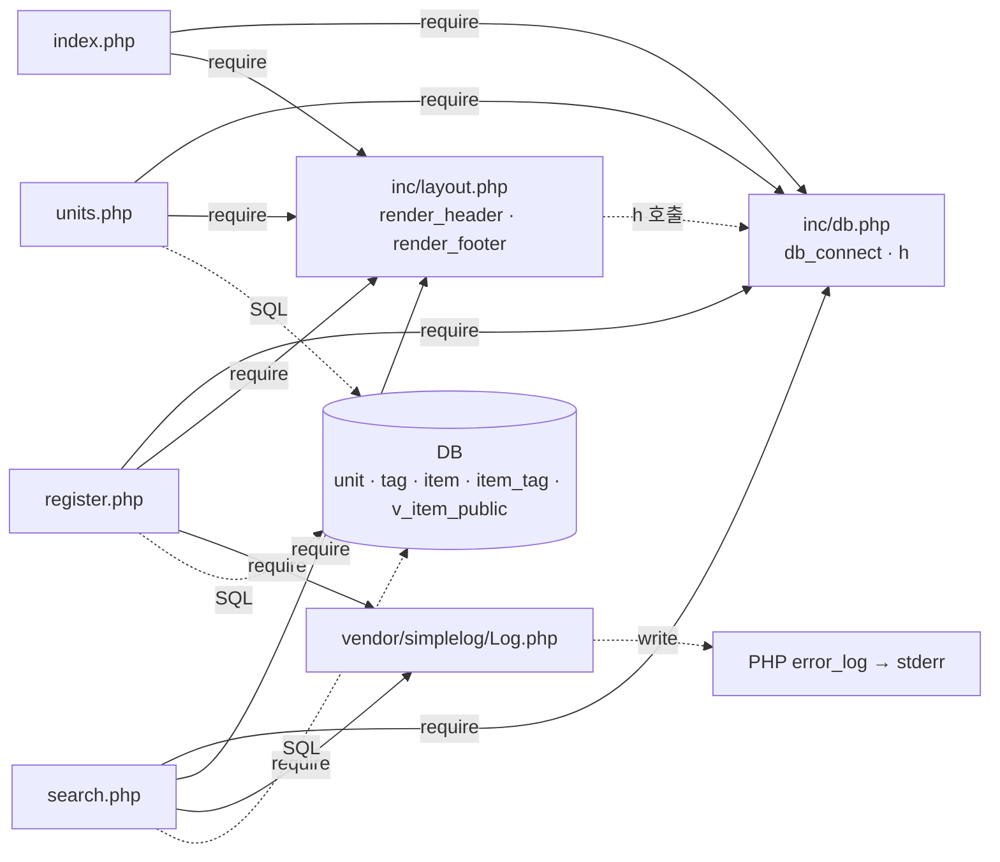

# legacy/item-bank-php 아키텍처

> 분석 범위: 진입점 · 의존 관계. 데이터 흐름 · 비즈니스 규칙은 아직 분석하지 않았다.
> 근거는 모두 `legacy/item-bank-php/` 기준 `파일:줄번호` 다.

## 1. 모듈 개요

- 문항 검색 · 등록 · 단원 목록 화면을 제공하는 PHP 7.4 + Apache 웹 모듈이다 (`Dockerfile:1`).
- 프레임워크 · 라우터 없이 파일 하나가 화면 하나이고, URL 이 곧 파일 경로다 (`Dockerfile:14`).
- DB 는 mysqli 로 접속한다 (`Dockerfile:3`, `inc/db.php:21`). 공통 코드는 `inc/`, 로깅은 `vendor/simplelog` 이다.
- 파일 8개, 총 약 1,070줄. `search.php` 가 731줄로 전체의 약 68% 다.

## 2. 폴더 구조

```
legacy/item-bank-php/
├── Dockerfile                 16줄   php:7.4-apache, mysqli, rewrite, 로그 → stderr
├── index.php                  14줄   홈 메뉴
├── units.php                  48줄   단원 목록
├── register.php              177줄   문항 등록 (함수 없음)
├── search.php                731줄   문항 검색 (함수 4개)
├── inc/
│   ├── db.php                 37줄   db_connect(), h()
│   └── layout.php             43줄   render_header(), render_footer()
└── vendor/simplelog/Log.php   54줄   외부 로깅 라이브러리(더미, 수정 금지 — Log.php:3)
```

## 3. 진입점

`a2enmod rewrite` 는 켜져 있으나 (`Dockerfile:4`) 모듈 안에 `.htaccess` 는 없다.

| URL (화면) | 처음 실행되는 파일 | 부르는 주요 함수 |
|---|---|---|
| `GET /index.php` (홈 메뉴) | `index.php` | `render_header('홈')` `index.php:5`, `render_footer()` `index.php:14` — DB 조회 없음 |
| `GET /units.php` (단원 목록) | `units.php` | `render_header` `units.php:5`, `db_connect` `units.php:8`, `$conn->query` `units.php:20`, `h` `units.php:40-43`, `render_footer` `units.php:48` |
| `GET /register.php` (등록 폼) | `register.php` | `db_connect` `register.php:17`, 단원 조회 `register.php:27`, 태그 조회 `register.php:34`, `render_header` `register.php:127`, `render_footer` `register.php:177` |
| `POST /register.php` (문항 등록) | `register.php` (분기 `register.php:40`) | 위 GET 흐름 + `begin_transaction` `register.php:85`, `SELECT MAX(id)+1 … FOR UPDATE` `register.php:87`, `INSERT item` `register.php:92-94`, `INSERT item_tag` `register.php:105`, `commit` `register.php:114`, `Log::info` `register.php:115`, `rollback` `register.php:120`, `Log::error` `register.php:121` |
| `GET /search.php?q&unit&level&tag&sort&dir&page` (문항 검색) | `search.php` (파라미터 설명 `search.php:5-12`) | `render_header` `search.php:709`, `db_connect` `search.php:713`, `buildSearchQuery($_GET)` `search.php:722`, `renderSearchForm` `search.php:723`, `runSearchQuery` `search.php:724`, `renderResultTable` `search.php:725`, `Log::error` `search.php:727`, `render_footer` `search.php:731` |

화면 사이 이동:
- 메뉴 링크: `index.php:9-11`, `inc/layout.php:10-12`
- 폼 제출: `register.php:141` (POST → `register.php`), `search.php:632` (GET → `search.php`)

## 4. 의존 관계



실선은 `require_once`, 점선은 함수 호출 · SQL 이다.

### 4.1 포함 관계 (`require_once`)

| A → B (A 가 B 를 포함) | 근거 |
|---|---|
| `index.php` → `inc/db.php` | `index.php:2` |
| `index.php` → `inc/layout.php` | `index.php:3` |
| `units.php` → `inc/db.php` | `units.php:2` |
| `units.php` → `inc/layout.php` | `units.php:3` |
| `register.php` → `inc/db.php` | `register.php:2` |
| `register.php` → `inc/layout.php` | `register.php:3` |
| `register.php` → `vendor/simplelog/Log.php` | `register.php:4` (`use SimpleLog\Log` `register.php:6`) |
| `search.php` → `inc/db.php` | `search.php:20` |
| `search.php` → `inc/layout.php` | `search.php:21` |
| `search.php` → `vendor/simplelog/Log.php` | `search.php:22` (`use SimpleLog\Log` `search.php:24`) |

### 4.2 호출 관계

| A → B (A 가 B 를 호출) | 근거 |
|---|---|
| `inc/layout.php` `render_header` → `inc/db.php` `h` | `inc/layout.php:17`, `inc/layout.php:33` |
| `search.php` 실행부 → `buildSearchQuery` | `search.php:722` |
| `search.php` 실행부 → `renderSearchForm` | `search.php:723` |
| `search.php` 실행부 → `runSearchQuery` | `search.php:724` |
| `search.php` 실행부 → `renderResultTable` | `search.php:725` |
| `buildSearchQuery` → `Log::debug` · `Log::error` | `search.php:103`, `search.php:528`, `search.php:537` |
| `buildSearchQuery` → `h` | `search.php:360` ~ `search.php:513` (여러 곳) |
| `buildSearchQuery` → DB (unit · tag 조회) | `search.php:125`, `search.php:156`, `search.php:178` |
| `renderResultTable` → `h` | `search.php:674-678`, `search.php:690-700` |
| `Log::write` → PHP `error_log()` | `vendor/simplelog/Log.php:52` (출력 위치 `Dockerfile:11`) |

주의: `inc/layout.php` 는 `inc/db.php` 를 스스로 포함하지 않는다. 진입점 4개가 모두 `db.php` → `layout.php` 순서로 포함하기 때문에 동작한다 (`index.php:2-3`, `units.php:2-3`, `register.php:2-3`, `search.php:20-21`).

### 4.3 DB 객체 참조

| 파일 | 테이블 · 뷰 | 근거 |
|---|---|---|
| `units.php` | `unit`, `item` | `units.php:16-18` |
| `register.php` | `unit`, `tag`, `item`, `item_tag` | `register.php:27`, `register.php:34`, `register.php:87`, `register.php:93`, `register.php:105` |
| `search.php` | `unit`, `tag`, `v_item_public` | `search.php:125`, `search.php:156`, `search.php:178`, `search.php:522` |

## 5. 가장 긴 함수 3개

시작 줄은 `function` 선언, 끝 줄은 0열 `}` 다.

| 순위 | 파일 | 함수 | 시작 ~ 끝 (줄 수) | 하는 일 |
|---|---|---|---|---|
| 1 | `search.php` | `buildSearchQuery` | `search.php:42` ~ `search.php:564` (523줄) | GET 파라미터를 검증하고 WHERE · ORDER BY · LIMIT, 바인딩 값, 폼 · 정렬 링크 · 경고 HTML 을 한 번에 만들어 배열로 반환 (주석 `search.php:29-41`, 반환 `search.php:541-563`) |
| 2 | `search.php` | `renderResultTable` | `search.php:647` ~ `search.php:704` (58줄) | 경고 · 요약 · 건수, 결과 표(id · title · unit · level · tags), 페이지 이동 링크 출력 |
| 3 | `search.php` | `runSearchQuery` | `search.php:571` ~ `search.php:624` (54줄) | 건수 SQL 과 목록 SQL 을 각각 prepare → bind → execute 해 `total` · `rows` 반환 |

나머지 함수: `render_header` `inc/layout.php:7-36`(30줄), `db_connect` `inc/db.php:7-29`(23줄), `renderSearchForm` `search.php:629-641`(13줄), `render_footer` `inc/layout.php:38-43`, `h` `inc/db.php:34-37`.

## 6. 미확인 목록

| 항목 | 현재 알고 있는 것 | 확인할 곳 |
|---|---|---|
| 모듈 밖 Apache · rewrite 규칙 | rewrite 모듈만 켜져 있음 (`Dockerfile:4`), 모듈 안에 `.htaccess` 없음 | 서버 · compose 설정 |
| `v_item_public` 뷰 정의 | `search.php:522` 에서 FROM 으로 사용. 등록 직후 문항은 검색에 안 나온다는 주석 (`register.php:84`) | DB 스키마 |
| `buildSearchQuery` 본문 전체 | 경계 · 조건문 · 외부 호출 줄만 확인. 본문(`search.php:42-564`)을 한 줄씩 읽지 않음 | 3단계(데이터 흐름) |
| 검색 조건이 WHERE 에 붙는 방식 | 검증 줄 위치만 확인: `search.php:86`, `:91`, `:94`, `:111`, `:217`, `:276`, `:345` | 3단계 |
| `$orderBy` 가 화이트리스트로만 만들어지는지 | 문자열로 이어 붙임 (`search.php:525`) | 3단계 |
| 테이블 컬럼 · 제약 | SQL 에 쓰인 컬럼만 보임 | DB 스키마 |
