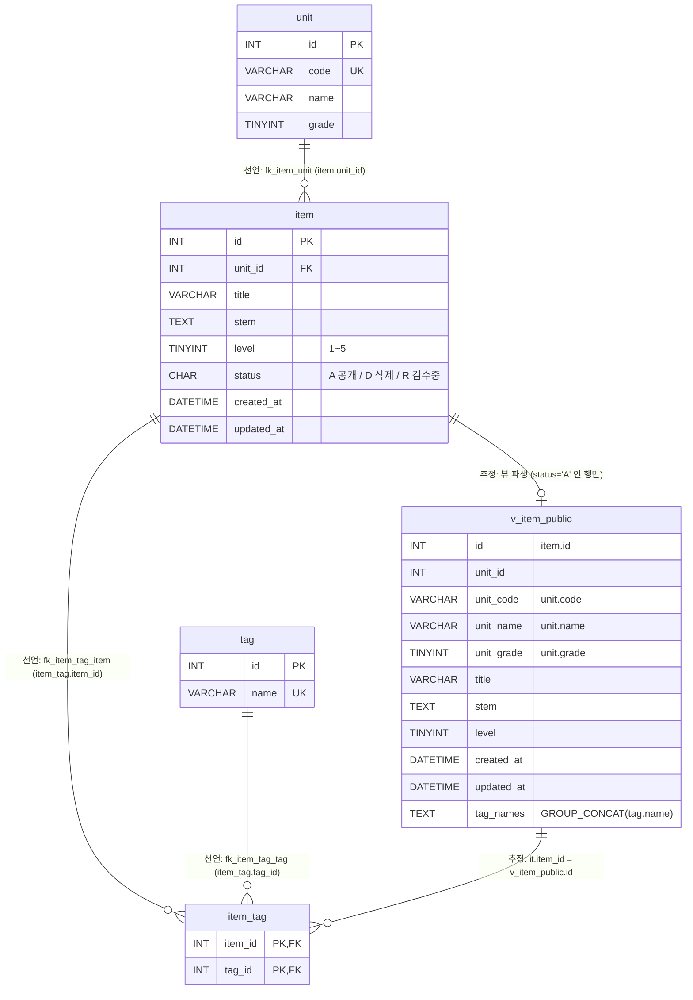
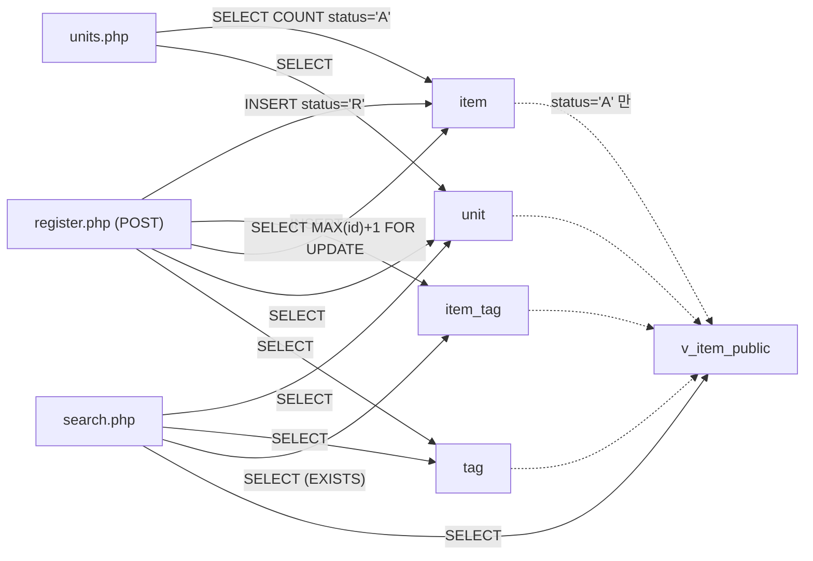

# legacy/item-bank-php 데이터 흐름 · ERD

> 분석 범위: `legacy/item-bank-php/` 가 읽고 쓰는 DB 객체. 선행 문서는 [ARCHITECTURE.md](ARCHITECTURE.md).
> 스키마 근거는 `db/mariadb/init/01-schema.sql`(compose 가 `/docker-entrypoint-initdb.d` 로 마운트 — `docker-compose.yml:25`),
> 코드 근거는 `legacy/item-bank-php/` 기준 `파일:줄번호` 다.
> 같은 DB(`itembank`)에 있는 과제 배포 테이블(`class` · `assignment` · `distribution` · `submission`, `01-schema.sql:75-115`)은
> 이 모듈이 참조하지 않으므로 범위 밖이다 (모듈 내 SQL 전수 확인 결과).

## 1. 테이블 목록

| 테이블 · 뷰 | 주요 컬럼 | 키 · 제약 | 근거 |
|---|---|---|---|
| `unit` (단원) | `id` INT, `code` VARCHAR(16), `name` VARCHAR(100), `grade` TINYINT | PK `id`, UNIQUE `code` (`uk_unit_code`) | `db/mariadb/init/01-schema.sql:11-18` / 코드: `units.php:16-18`, `register.php:27`, `search.php:125`, `search.php:156` |
| `item` (문항) | `id` INT, `unit_id` INT, `title` VARCHAR(200), `stem` TEXT, `level` TINYINT(1~5), `status` CHAR(1) 기본 `'A'` (A=공개 D=삭제 R=검수중), `created_at` · `updated_at` DATETIME | PK `id`(AUTO_INCREMENT 아님), FK `unit_id → unit.id`, 인덱스 `unit_id` · `level` | `01-schema.sql:20-33` / 코드: `units.php:17`, `register.php:87`, `register.php:93-94` |
| `tag` (태그) | `id` INT, `name` VARCHAR(50) | PK `id`, UNIQUE `name` (`uk_tag_name`) | `01-schema.sql:35-40` / 코드: `register.php:34`, `search.php:178`, `search.php:244` |
| `item_tag` (문항-태그 연결) | `item_id` INT, `tag_id` INT | 복합 PK (`item_id`, `tag_id`), FK 2개 | `01-schema.sql:42-48` / 코드: `register.php:105`, `search.php:244-245` |
| `v_item_public` (뷰, 공개 문항) | `id`, `unit_id`, `unit_code`, `unit_name`, `unit_grade`, `title`, `stem`, `level`, `created_at`, `updated_at`, `tag_names`(쉼표로 이은 태그 이름, `t.id` 순) | `item JOIN unit` + `WHERE i.status = 'A'`, `tag_names` 는 `item_tag JOIN tag` 상관 서브쿼리 | `01-schema.sql:52-70` / 코드: `search.php:521-522`, `search.php:526` |

## 2. 테이블 관계

| 관계 | 구분 | 근거 |
|---|---|---|
| `unit` 1 — N `item` (`item.unit_id → unit.id`) | 선언 | `01-schema.sql:32`. 코드에서도 같은 조건으로 조인: `units.php:17`(상관 서브쿼리), 뷰 `01-schema.sql:69` |
| `item` 1 — N `item_tag` (`item_tag.item_id → item.id`) | 선언 | `01-schema.sql:46`. 코드: `register.php:105-107`(새 `item.id` 로 INSERT) |
| `tag` 1 — N `item_tag` (`item_tag.tag_id → tag.id`) | 선언 | `01-schema.sql:47`. 코드 JOIN: `search.php:244`, 뷰 `01-schema.sql:66` |
| `item` → `v_item_public` (`status = 'A'` 인 문항만, `unit` 과 INNER JOIN) | 추정(뷰 정의에서 파생, FK 아님) | `01-schema.sql:68-70` |
| `v_item_public.id` = `item_tag.item_id` | 추정(코드 JOIN, 뷰라서 FK 없음) | `search.php:245` |

- `item` ↔ `tag` 는 `item_tag` 를 통한 N:M 이다 (`01-schema.sql:42-48`).
- `item.unit_id` 는 `NOT NULL` 이라 모든 문항은 단원 하나에 속한다 (`01-schema.sql:22`).
- `unit` 을 참조하는 `assignment.unit_id` FK(`01-schema.sql:89`)도 있으나 이 모듈 범위 밖이라 그림에서 뺐다.

## 3. 읽기 · 쓰기 위치

`units.php` · `register.php` 는 함수 없이 최상위 스크립트에서 SQL 을 실행한다. 표에는 "최상위"로 적는다.

### 3.1 `unit`

| 구분 | 파일 · 함수 | SQL 요지 | 근거 |
|---|---|---|---|
| SELECT | `units.php` 최상위 | `SELECT u.id, u.code, u.name, u.grade, (공개 문항 수) FROM unit u ORDER BY grade, code` | `units.php:16-20` |
| SELECT | `register.php` 최상위 | `SELECT id, code, name FROM unit ORDER BY grade, code` — 단원 선택 목록 · `unit_id` 검증(`register.php:60-68`)에 사용 | `register.php:27` |
| SELECT | `search.php` `buildSearchQuery` | `SELECT name, grade FROM unit WHERE code = ?` — 검색 요약용 단원 이름 | `search.php:125` |
| SELECT | `search.php` `buildSearchQuery` | `SELECT code, name, grade FROM unit ORDER BY grade, code` — 검색 폼 선택 목록 | `search.php:156` |
| SELECT(간접) | `search.php` `runSearchQuery` | `v_item_public` 을 통해 `unit_code` 를 읽음 | `search.php:521-522`, `search.php:577`, `search.php:600` |
| INSERT · UPDATE · DELETE | 없음 (모듈 안) | 시드에서만 INSERT | `db/mariadb/init/02-seed.sql:9` |

### 3.2 `item`

| 구분 | 파일 · 함수 | SQL 요지 | 근거 |
|---|---|---|---|
| SELECT | `units.php` 최상위 | `SELECT COUNT(*) FROM item i WHERE i.unit_id = u.id AND i.status = 'A'` — 단원별 공개 문항 수 | `units.php:17` |
| SELECT (잠금) | `register.php` 최상위 (POST) | `SELECT COALESCE(MAX(id), 0) + 1 AS next_id FROM item FOR UPDATE` — 새 id 채번 | `register.php:87` |
| INSERT | `register.php` 최상위 (POST) | `INSERT INTO item (id, unit_id, title, stem, level, status, created_at, updated_at) VALUES (?, ?, ?, ?, ?, 'R', NOW(), NOW())` | `register.php:92-101` |
| SELECT(간접) | `search.php` `runSearchQuery` | `v_item_public` (= `status = 'A'` 문항) 에서 건수 · 목록 조회 | `search.php:577`, `search.php:600` (SQL 조립 `search.php:521-526`) |
| UPDATE · DELETE | 없음 (모듈 안) | `status` 를 `R → A`, `A → D` 로 바꾸는 코드가 이 모듈에 없음 → **미확인** (6절) | 모듈 전체 grep 결과 쓰기 SQL 은 `register.php:93`, `register.php:105` 뿐 |

### 3.3 `tag`

| 구분 | 파일 · 함수 | SQL 요지 | 근거 |
|---|---|---|---|
| SELECT | `register.php` 최상위 | `SELECT id, name FROM tag ORDER BY id` — 체크박스 목록 · 태그 id 검증(`register.php:74-81`) | `register.php:34` |
| SELECT | `search.php` `buildSearchQuery` | `SELECT name FROM tag ORDER BY id` — 검색 폼 선택 목록 · 등록 태그 여부 경고(`search.php:251-260`) | `search.php:178` |
| SELECT | `search.php` `runSearchQuery` (조건은 `buildSearchQuery` 가 조립) | `EXISTS (SELECT 1 FROM item_tag it JOIN tag t ON t.id = it.tag_id WHERE it.item_id = v_item_public.id AND t.name = ?)` | 조립 `search.php:244-245`, 실행 `search.php:577`, `search.php:600` |
| SELECT(간접) | `search.php` `runSearchQuery` | `v_item_public.tag_names` | `search.php:521` |
| INSERT · UPDATE · DELETE | 없음 (모듈 안) | 시드에서만 INSERT | `02-seed.sql:19` |

### 3.4 `item_tag`

| 구분 | 파일 · 함수 | SQL 요지 | 근거 |
|---|---|---|---|
| INSERT | `register.php` 최상위 (POST) | `INSERT INTO item_tag (item_id, tag_id) VALUES (?, ?)` — 검증된 태그마다 한 번씩(루프) | `register.php:104-112` |
| SELECT | `search.php` `runSearchQuery` (조건은 `buildSearchQuery`) | 태그 필터 `EXISTS` 서브쿼리 | `search.php:244-245` |
| SELECT(간접) | `search.php` `runSearchQuery` | 뷰의 `tag_names` 서브쿼리 | `01-schema.sql:64-67`, `search.php:521` |
| UPDATE · DELETE | 없음 (모듈 안) | — | — |

### 3.5 `v_item_public` (뷰)

| 구분 | 파일 · 함수 | SQL 요지 | 근거 |
|---|---|---|---|
| SELECT | `search.php` `runSearchQuery` | `SELECT COUNT(*) AS cnt FROM v_item_public WHERE …` (총 건수) | 조립 `search.php:526`, 실행 `search.php:577-597` |
| SELECT | `search.php` `runSearchQuery` | `SELECT id, title, unit_code, level, tag_names, created_at FROM v_item_public WHERE … ORDER BY … LIMIT 20 OFFSET <정수 이어 붙임>` (현재 페이지) | 조립 `search.php:521-525`, OFFSET `search.php:523`, 실행 `search.php:600-621` |

### 3.6 흐름 요약

- 등록한 문항은 `status = 'R'` 로 들어가므로 (`register.php:94`) `v_item_public`(`status = 'A'`, `01-schema.sql:70`) 을 읽는 검색 화면에도, `status = 'A'` 만 세는 단원 목록(`units.php:17`)에도 나타나지 않는다 (안내 문구 `register.php:116`).
- `search.php` 에서 `WHERE` 에 쓰는 컬럼: `title` · `stem`(`search.php:98`), `unit_code`(`search.php:118`), `level`(`search.php:215`, `:218`, `:226`), 태그 `EXISTS`(`search.php:244-245`). 정렬 컬럼은 `id` · `title` · `unit_code` · `level` · `created_at` 으로 `switch` 에 고정돼 있다 (`search.php:276-327`).

## 4. 데이터 관련 관찰 (이관 시 확인할 것)

| 관찰 | 근거 |
|---|---|
| `item.id` 는 AUTO_INCREMENT 가 아니고, 등록 시 `MAX(id)+1 … FOR UPDATE` 로 채번한다. | `01-schema.sql:21`, `register.php:87` |
| 등록은 트랜잭션 하나로 `item` INSERT → `item_tag` 루프 INSERT → commit, 실패 시 rollback 한다. | `register.php:85`, `register.php:114`, `register.php:120` |
| `updated_at` 은 등록 시 `NOW()` 로만 쓰고, 이를 갱신하는 코드는 모듈에 없다. | `register.php:94` |
| 난이도 파라미터가 비면 `level < 5` 조건이 붙어 난이도 5 문항이 빠진다. 주석(“1~5 모두 포함”)과 동작이 다르다. 시드도 이 동작을 전제로 건수를 맞춰 두었다. | `search.php:213-215`, `02-seed.sql:34` |
| 스키마 주석은 "등록 화면도 `v_item_public` 을 기준으로 삼는다"고 하지만 `register.php` 에는 뷰 참조가 없다. | `01-schema.sql:51`, `register.php` 전체 |
| `v_item_public` 은 `unit` 과 INNER JOIN 하므로 단원이 없는 공개 문항은 뷰에서 빠진다. 단, FK(`fk_item_unit`) · `NOT NULL` 때문에 그런 행은 생기지 않는다. | `01-schema.sql:22`, `01-schema.sql:32`, `01-schema.sql:69` |

## 5. 미확인

| 항목 | 현재 알고 있는 것 | 확인할 곳 |
|---|---|---|
| `item.status` 를 `R → A`(검수 완료), `A → D`(삭제) 로 바꾸는 주체 | 이 모듈에 `UPDATE` · `DELETE` 문 없음. 상태 코드 의미는 스키마 주석에만 있음 (`01-schema.sql:26`) | 다른 레거시 모듈 · 운영 스크립트 · 관리자 도구 |
| `unit` · `tag` 를 추가 · 수정하는 주체 | 모듈에 쓰기 없음, 시드 INSERT 만 확인 (`02-seed.sql:9`, `:19`) | 운영 절차 · 다른 모듈 |
| `item_tag` 의 수정 · 삭제 경로 | 모듈에는 INSERT 만 있음 (`register.php:105`) | 위와 같음 |
| 운영 DB 스키마가 `01-schema.sql` 과 같은지 | 로컬 compose 초기화 스크립트 기준으로만 확인함 | 운영 DB DDL |
| `v_item_public` 외의 뷰 · 트리거 · 프로시저 | `01-schema.sql` 에는 뷰 1개만 있고 트리거 · 프로시저 없음 | 운영 DB |
